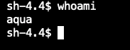

## General

This guide explains how to deploy and use the Khulnasoft Security Operator to manage Khulnasoft's deployments in an OpenShift 4.x environment. You can use the Operator to deploy Khulnasoft Enterprise or any of its components -

- Server (aka “console”)
- Database (optional; you can map an external database as well)
- Gateway
- Enforcer
- Scanner
- KubeEnforcer

Use the Khulnasoft Operator to:

- Easily deploy Khulnasoft Enterprise on OpenShift
- Manage and scale up Khulnasoft security components with additional replicas
- Assign metadata tags to Khulnasoft Enterprise components
- Easily add and delete Khulnasoft components like Scanner daemons, Kube-Enforcers and Enforcers

You can find all Khulnasoft's Operator CRs and their properties at [Custom Resources](../config/crd/bases),
[Properties](../config/samples).

## Prerequisites

Make sure you have a license and access to the Khulnasoft registry. To obtain a license, please contact Khulnasoft Security at https://www.khulnasoft.com/about-us/contact-us/.

It is advised that you read about the [Khulnasoft Environment and Configuration](https://docs.khulnasoft.com/docs/purpose-of-this-section) and [Khulnasoft's sizing guide](https://docs.khulnasoft.com/docs/sizing-guide) before deploying and using the Operator.

## Types of Khulnasoft Operator

Khulnasoft Security maintains three types of Operators:

- **Marketplace** - The marketplace operator is purchased through Red Hat Marketplace.
- **Community** - Khulnasoft's official Operator. It typically represents the latest and newest version of the Operator.
- **Certified** - Khulnasoft's official Operator vetted and certified by RedHat. The certified Operator is based on the latest community Operator. It is packaged in a mode that allows it to work in disconnected networks, and contains UBI images as part of the package.

## Deploying the Khulnasoft Operator

1. Create a new namespace/project called "khulnasoft" for the Khulnasoft deployment.

2. Install the Khulnasoft Operator from Red Hat's OperatorHub and add it to the "khulnasoft" namespace.

3. Create a secret for the database password

```
oc create secret generic khulnasoft-database-password --from-literal=db-password=<password> -n khulnasoft
```

4. To work with the community Operator, you need to create a registry secret to Khulnasoft's images registry. Khulnasoft's registry credentials are identical to the username and password for Khulnasoft's support portal (https://success.khulnasoft.com.) -

```bash
oc create secret docker-registry khulnasoft-registry --docker-server=registry.khulnasoft.com --docker-username=<KHULNASOFT_USERNAME> --docker-password=<KHULNASOFT_PASSWORD> --docker-email=<user email> -n khulnasoft
```

## Deploying Khulnasoft Enterprise using Custom Resources

The Khulnasoft Operator includes a few CRDs to allow you to deploy Khulnasoft in different configurations. Before you create your deployment CR, please review commons CR examples in the section _CR Examples_ below.

**[KhulnasoftCSP CRD](../config/crd/bases/operator.khulnasoft.com_khulnasoftcsps.yaml)** provides the fastest methods to deploy Khulnasoft Enterprise in a single cluster. KhulnasoftCSP defines how to deploy the Server, Gateway, Khulnasoft Enforcer, and KubeEnforcer in the target cluster. Please see the [example CR](../config/samples/operator_v1alpha1_khulnasoftcsp.yaml) for the listing of all fields and configurations.

- You can set the enforcement mode using the `.spec.enforcer.enforceMode` property in the CR file.
- You can deploy a Route by setting the `.spec.route` property to "true".
- The default service type for the Console and Gateway is ClusterIP. You can change the service type in the CR.
- You can choose to deploy a different version of Khulnasoft CSP by setting the `.spec.infra.version` property or change the image `.spec.<<server/gateway/database>>.image.tag`.
- You can choose to use an external database by providing the `.spec.externalDB` property details.
- You can omit the Enforcer and KubeEnforcer components by removing them from the CR.
- You can add server/gateway environment variables with `.spec.<<serverEnvs/gatewayEnvs>>` (same convention of name value as k8s deployment).
- You can add server configmap variables with `.spec.serverConfigMapData` (same convention of name value as k8s deployment).
- You can define the server/gateway resources requests/limits with `.spec.<<server/gateway>>.resources`
- You can define the server/gateway nodeSelector with
  `.spec.<<server/gateway>>.nodeSelector`
- You can define the server/gateway affinity with
  `.spec.<<server/gateway>>.affinity`
- You can define the server/gateway toleration with
  `.spec.<<server/gateway>>.tolerations`

The **[KhulnasoftServer CRD](../config/crd/bases/operator.khulnasoft.com_khulnasoftservers.yaml)**, **[KhulnasoftDatabase CRD](../config/samples/operator_v1alpha1_khulnasoftdatabase.yaml)**, and **[KhulnasoftGateway CRD](../config/samples/operator_v1alpha1_khulnasoftgateway.yaml)** are used for advanced configurations where the server components are deployed across multiple clusters.

**[KhulnasoftEnforcer CRD](../config/samples/operator_v1alpha1_khulnasoftenforcer.yaml)** is used to deploy the Khulnasoft Enforcer in any cluster. Please see the [example CR](../config/samples/operator_v1alpha1_khulnasoftenforcer.yaml) for the listing of all fields and configurations.

- You need to provide a token to identify the Khulnasoft Enforcer.
- You can set the target Gateway using the `.spec.gateway.host`and `.spec.gateway.port` properties.
- You can choose to deploy a different version of the Khulnasoft Enforcer by setting the `.spec.deploy.image.tag` property.
  If you choose to run old/custom Khulnasoft Enforcer version, you must set `.spec.common.allowAnyVersion` .
- You can add environment variables using `.spec.env`.
- You can define the enforcer resources requests/limits using `.spec.deploy.resources`.
- You can define the enforcer nodeSelector with
  `.spec.deploy.nodeSelector`
- You can define the enforcer affinity with
  `.spec.deploy.affinity`
- You can define the enforcer toleration with
  `.spec.deploy.tolerations`

**[KhulnasoftKubeEnforcer CRD](../config/crd/bases/operator.khulnasoft.com_khulnasoftkubeenforcers.yaml)** is used to deploy the KubeEnforcer in your target cluster. Please see the [example CR](../config/samples/operator_v1alpha1_khulnasoftkubeenforcer.yaml) for the listing of all fields and configurations.

- You need to provide a token to identify the KubeEnforcer to the Khulnasoft Server.
- You can set the target Gateway using the `.spec.config.gateway_address` property.
- You can choose to deploy a different version of the KubeEnforcer by setting the `.spec.deploy.image.tag` property.
  If you choose to run old/custom Khulnasoft KubeEnforcer version, you must set `.spec.allowAnyVersion` .
- You can add environment variables using `.spec.env`.
- You can define the kube-enforcer resources requests/limits using `.spec.deploy.resources`.
- You can define the kube-enforcer nodeSelector with
  `.spec.deploy.nodeSelector`
- You can define the kube-enforcer affinity with
  `.spec.deploy.affinity`
- You can define the kube-enforcer toleration with
  `.spec.deploy.tolerations`

**[KhulnasoftStarboard CRD](../config/crd/bases/khulnasoft.github.io_khulnasoftstarboards.yaml)** is used to deploy the KhulnasoftStarboard in your target cluster by kube-enforcer.

**[ClusterConfigAuditReports CRD](../config/crd/bases/khulnasoft.github.io_clusterconfigauditreports.yaml)** is used to deploy the ClusterConfigAuditReports in your target cluster by starboard.

**[ConfigAuditReports CRD](../config/crd/bases/khulnasoft.github.io_configauditreports.yaml)** is used to deploy the ConfigAuditReports in your target cluster by starboard.

**[KhulnasoftScanner CRD](../config/crd/bases/operator.khulnasoft.com_khulnasoftscanners.yaml)** is used to deploy the Khulnasoft Scanner in any cluster. Please see the [example CR](../config/samples/operator_v1alpha1_khulnasoftscanner.yaml) for the listing of all fields and configurations.

- You need to set the target Khulnasoft Server using the `.spec.login.host` property.
- You need to provide the `.spec.login.username` and `.spec.login.password` to authenticate with the Khulnasoft Server.
- You can choose to provide `.spec.login.token` to enable token based authentication with the khulnasoft server, If the `.spec.login.token` is defined in spec username and password are not considered. Token authentication takes higher precedence over a username and password authentication.
- You can set `.spec.login.tlsNoVerify` if you connect scanner to HTTPS server, and don't want to use mTLS verification.
- You can choose to deploy a different version of the Khulnasoft Scanner by setting the `.spec.image.tag` property.
  If you choose to run old/custom Khulnasoft Scanner version, you must set `.spec.common.allowAnyVersion` .
- You can define the scanner resources requests/limits using `.spec.deploy.resources`.
- You can define the scanner nodeSelector with
  `.spec.deploy.nodeSelector`
- You can define the scanner affinity with
  `.spec.deploy.affinity`
- You can define the scanner toleration with
  `.spec.deploy.tolerations`

## Advanced Configuration

### Configuring mTLS

The mTLS will be enabled automatically if the following secretes are available in the namespace:

- khulnasoft-grpc-web
- khulnasoft-grpc-gateway
- khulnasoft-grpc-enforcer
- khulnasoft-grpc-kube-enforcer

1. Generate TLS certificates signed by a public CA or Self-Signed CA for server and gateway

   ```shell
   # Self-Signed Root CA (Optional)
   #############################################################################################################
   # Create Root Key
   # If you want a non password protected key just remove the -des3 option
   openssl genrsa -des3 -out rootCA.key 4096
   # Create and self sign the Root Certificate
   openssl req -x509 -new -nodes -key rootCA.key -sha256 -days 1024 -out rootCA.crt
   #############################################################################################################
   # Generate Khulnasoft component certificates
   #############################################################################################################

   # Create keys (You can skip this step if you have already created a CSR file for the different components)
   openssl genrsa -out khulnasoft_web.key 2048
   openssl genrsa -out khulnasoft_gateway.key 2048
   openssl genrsa -out khulnasoft_enforcer.key 2048
   openssl genrsa -out khulnasoft_kube-enforcer.key 2048
   # Create config files
   ## Create the khulnasoft-web SSL config file
   cat >khulnasoft-web.conf <<EOF
   [ req ]default_bits = 2048
   distinguished_name = req_distinguished_name
   req_extensions = req_ext
   prompt = no
   [ req_distinguished_name ]
   countryName = Country Name (2 letter code)
   stateOrProvinceName = State or Province Name (full name)
   localityName = Locality Name (e.g., city)
   organizationName = Organization Name (e.g., company)
   commonName = Common Name (e.g., server FQDN or YOUR name)
   [ req_ext ]
   subjectAltName = @alt_names
   [alt_names]
   DNS.1 = <console host public DNS>
   DNS.2 = <console service DNS e.g. khulnasoft-web>
   IP.1 = <console service IP e.g. 10.X.X.X>
   EOF
   ## Create the Khulnasoft Gateway SSL config file
   cat >khulnasoft-gateway.conf <<EOF
   [ req ]default_bits = 2048
   distinguished_name = req_distinguished_name
   req_extensions = req_ext
   prompt = no
   [ req_distinguished_name ]
   countryName = Country Name (2 letter code)
   stateOrProvinceName = State or Province Name (full name)
   localityName = Locality Name (e.g., city)
   organizationName = Organization Name (e.g., company)
   commonName = Common Name (e.g., server FQDN or YOUR name)
   [ req_ext ]
   subjectAltName = @alt_names
   [alt_names]
   DNS.1 = <gateway public DNS>
   DNS.2 = <gateway service DNS e.g. khulnasoft-gateway>
   EOF
   # Generate signings (csr)
   ## Generate a CSR file for khulnasoft_web csr
   openssl req -new -sha256 -key khulnasoft_web.key -config khulnasoft-web.conf \
     -out khulnasoft_web.csr
   ## Generate a CSR file for khulnasoft_gateway csr
   openssl req -new -sha256 -key khulnasoft_gateway.key -config khulnasoft-gateway.conf \
     -out khulnasoft_gateway.csr
   ## Create the Khulnasoft Enforcer csr
   openssl req -new -sha256 -key khulnasoft_enforcer.key \
     -subj "/C=US/ST=MA/O=khulnasoft/CN=khulnasoft-agent" \
     -out khulnasoft_enforcer.csr
   ## Create the Khulnasoft Kube Enforcer csr
   openssl req -new -sha256 -key khulnasoft_kube-enforcer.key \
     -subj "/C=US/ST=MA/O=khulnasoft/CN=khulnasoft-kube-enforcer" \
     -out khulnasoft_kube-enforcer.csr
   # Generate the certificates
   ## Generate khulnasoft web certificate using the CSR along with appropriate private keys and get it signed by the CA root key
   openssl x509 -req -in khulnasoft_web.csr -CA rootCA.crt\
     -CAkey rootCA.key -CAcreateserial \
     -out khulnasoft_web.crt -days 500 -sha256 \
     -extensions req_ext -extfile khulnasoft-web.conf
   ## Generate khulnasoft gateway certificate using the CSR along with appropriate private keys and get it signed by the CA root key
   openssl x509 -req -in khulnasoft_gateway.csr -CA rootCA.crt -CAkey rootCA.key \
     -CAcreateserial -out khulnasoft_gateway.crt -days 500 \
     -sha256 -extensions req_ext -extfile khulnasoft-gateway.conf
   ## Generate khulnasoft enforcer certificate using the CSR along with appropriate private keys and get it signed by the CA root key
   openssl x509 -req -in khulnasoft_enforcer.csr -CA rootCA.crt \
     -CAkey rootCA.key -CAcreateserial -out khulnasoft_enforcer.crt \
     -days 500 -sha256
   ## Generate khulnasoft kube enforcer certificate using the CSR along with appropriate private keys and get it signed by the CA root key
   openssl x509 -req -in khulnasoft_kube-enforcer.csr -CA rootCA.crt \
     -CAkey rootCA.key -CAcreateserial -out khulnasoft_kube-enforcer.crt \
     -days 500 -sha256
   # Verify certificates (optional)
   openssl x509 -in khulnasoft_web.crt -text -noout
   openssl x509 -in khulnasoft_gateway.crt -text -noout
   openssl x509 -in khulnasoft_enforcer.crt -text -noout
   openssl x509 -in khulnasoft_kube-enforcer.crt -text -noout
   ```

2. Create secrets for server, gateway, enforcer and kube-enforcer components using the generated SSL certificates.

   ```shell
   # Khulnasoft web:
   oc create secret generic khulnasoft-grpc-web --from-file=rootCA.crt \
    --from-file=khulnasoft_web.crt --from-file=khulnasoft_web.key -n khulnasoft
   # Khulnasoft gateway
   oc create secret generic khulnasoft-grpc-gateway --from-file=rootCA.crt \
    --from-file=khulnasoft_gateway.crt --from-file=khulnasoft_gateway.key -n khulnasoft
   # Khulnasoft enforcer
   oc create secret generic khulnasoft-grpc-enforcer --from-file=rootCA.crt \
    --from-file=khulnasoft_enforcer.crt --from-file=khulnasoft_enforcer.key -n khulnasoft
   # Khulnasoft kube-enforcer
   oc create secret generic khulnasoft-grpc-kube-enforcer \
    --from-file=rootCA.crt --from-file=khulnasoft_kube-enforcer.crt \
    --from-file=khulnasoft_kube-enforcer.key -n khulnasoft
   ```

### Running as unprivileged - for all the components except KubeEnforcer

1. Create a new SCC (Security Context Constraint):

   The khulnasoft-scc yaml defines the cluster’s security context constraints. We strongly recommend not changing anything in this yaml file.

   - Download [khulnasoft-scc](../config/rbac/khulnasoft-scc.yaml) yaml.
   - Apply it by typing:

```shell
oc apply -f khulnasoft-scc.yaml
```

2. set\create `.spec.runAsNonRoot` property with `true` value, example:

```yaml
spec:
  runAsNonRoot: true
```

3. To verify it, please run the following command in the relevant pod:
   `whoami`

   Example result:

   

### Running as unprivileged - for KubeEnforcer only

1. Create a new SCC (Security Context Constraint):

   The khulnasoft-kube-enforcer-scc yaml defines the cluster’s security context constraints. We strongly recommend not changing anything in this yaml file.

   - Download [khulnasoft-kube-enforcer-scc](../config/rbac/khulnasoft-kube-enforcer-scc.yaml) yaml.
   - Apply it by typing:

```shell
oc apply -f khulnasoft-kube-enforcer-scc.yaml
```

2. set\create `.spec.runAsNonRoot` property with `true` value, example:

```yaml
spec:
  runAsNonRoot: true
```

3. To verify it, please run the following command in the relevant pod:
   `whoami`

   Example result:

   

### Assign Pods to Nodes

#### NodeSelector

1. Add a label to a node, with the following command:

   ```
   kubectl label nodes <your-node-name> <key>=<value>
   ```

   Example:

   ```
   kubectl label nodes node1 khulnasoftdeployments=true
   ```

2. Verify that your chosen node has yours <key>=<value> label:

   ```
   kubectl get nodes --selector=<key>=<value>
   ```

   Example:

   ```
   kubectl get nodes --selector=khulnasoftdeployments=true
   ```

   Example output:

   ```
   NAME     STATUS   ROLES    AGE   VERSION
   node1    Ready    worker   4d    v1.20.14+0d60930
   ```

3. Set\Create `.spec.deploy.nodeSelector` property with `map[string]string` value, example:
   ```yaml
   spec:
     nodeSelector:
       key: value
   ```
   example:
   ```yaml
   spec:
     nodeSelector:
       khulnasoftdeployments: "true"
   ```

#### Affinity

1. Set\Create `.spec.deploy.affinity` property
   example:
   ```yaml
   spec:
     affinity:
       podAntiAffinity:
         requiredDuringSchedulingIgnoredDuringExecution:
           - labelSelector:
               matchExpressions:
                 - key: app
                   operator: In
                   values:
                     - store
             topologyKey: "kubernetes.io/hostname"
   ```

### Toleration

1. add a taint to a node
2. Set\Create `.spec.deploy.tolerations` property

   example:

   ```yaml
   spec:
     tolerations:
       - key: "key1"
         operator: "Exists"
         value: "value1"
         effect: "NoSchedule"
   ```

## Operator Upgrades

**Major versions** - When switching from an older operator channel to this channel,
the operator will update the Khulnasoft components to this channel Khulnasoft version.

**Minor versions** - For the certified operator, the Khulnasoft operator is using the "Seamless Upgrades" mechanism.
You can set the upgrade approval strategy in the operator subscription to either "Automatic" or "Manual".
If you choose "Automatic", the OLM will automatically upgrade to the latest operator version in this channel
with the latest Khulnasoft components images. If you choose the "Manual" approval strategy, the OLM will
only notify you there is an update available, and will upgrade the operator version and Khulnasoft components
only after a manual approval given.

_If you choose "Manual" approval strategy, we recommend that before approving, make sure you are indeed
upgrading to the most updated version. you can do that by deleting the suggested InstallPlan, once the
suggested InstallPlan is deleted, the OLM will generate a new InstallPlan to the latest version available
in this channel_

For community operator, you can upgrade minor version by changing the relevant CRs
`.spec.infra.version` or `.spec.<<NAME>>.image.tag`

## CR Examples

#### Example: Deploying the Khulnasoft Server with an Khulnasoft Enforcer and KubeEnforcer (all in one CR)

```yaml
---
apiVersion: operator.khulnasoft.com/v1alpha1
kind: KhulnasoftCsp
metadata:
  name: khulnasoft
  namespace: khulnasoft
spec:
  infra:
    serviceAccount: "khulnasoft-sa"
    namespace: "khulnasoft"
    version: "2022.4"
    requirements: true
  common:
    imagePullSecret: "khulnasoft-registry" # Optional: If already created image pull secret then mention in here
    dbDiskSize: 10
    databaseSecret: # Optional: If already created database secret then mention in here
      key: "db-password"
      name: "khulnasoft-database-password"
  database:
    replicas: 1
    service: "ClusterIP"
    image:
      registry: "registry.khulnasoft.com"
      repository: "database"
      tag: "<<IMAGE TAG>>"
      pullPolicy: Always
  gateway:
    replicas: 1
    service: "ClusterIP"
    image:
      registry: "registry.khulnasoft.com"
      repository: "gateway"
      tag: "<<IMAGE TAG>>"
      pullPolicy: Always
  server:
    replicas: 1
    service: "LoadBalancer"
    image:
      registry: "registry.khulnasoft.com"
      repository: "console"
      tag: "<<IMAGE TAG>>"
      pullPolicy: Always
  enforcer: # Optional: If defined, the Operator will create the default Khulnasoft Enforcer
    enforcerMode: false # Defines whether the default Enforcer will work in "Enforce" (true) or "Audit Only" (false) mode
  kubeEnforcer: # Optional: If defined, the Operator will create a KubeEnforcer
    registry: "registry.khulnasoft.com"
    tag: "<<IMAGE TAG>>"
  route: true # Optional: If defined and set to true, the Operator will create a Route to enable access to the console
  runAsNonRoot: false # Optional: If defined and set to true, the Operator will create the pods with unprivileged user.
```

If you haven't used the "route" option in the Khulnasoft CSP CR, you should define a Route manually to enable external access to the Khulnasoft Server (Console).

#### Example: Simple deployment of the Khulnasoft Server

```yaml
---
apiVersion: operator.khulnasoft.com/v1alpha1
kind: KhulnasoftCsp
metadata:
  name: khulnasoft
  namespace: khulnasoft
spec:
  infra:
    serviceAccount: "khulnasoft-sa"
    namespace: "khulnasoft"
    version: "2022.4"
    requirements: true
  common:
    imagePullSecret: "khulnasoft-registry" # Optional: If already created image pull secret then mention in here
    dbDiskSize: 10
    databaseSecret: # Optional: If already created database secret then mention in here
      key: "db-password"
      name: "khulnasoft-database-password"
  database:
    replicas: 1
    service: "ClusterIP"
    image:
      registry: "registry.khulnasoft.com"
      repository: "database"
      tag: "<<IMAGE TAG>>"
      pullPolicy: Always
  gateway:
    replicas: 1
    service: "ClusterIP"
    image:
      registry: "registry.khulnasoft.com"
      repository: "gateway"
      tag: "<<IMAGE TAG>>"
      pullPolicy: Always
  server:
    replicas: 1
    service: "LoadBalancer"
    image:
      registry: "registry.khulnasoft.com"
      repository: "console"
      tag: "<<IMAGE TAG>>"
      pullPolicy: Always
  route: true # Optional: If defined and set to true, the Operator will create a Route to enable access to the console
  runAsNonRoot: false # Optional: If defined and set to true, the Operator will create the pods with unprivileged user.
```

If you haven't used the "route" option in the Khulnasoft CSP CR, you should define a Route manually to enable external access to the Khulnasoft Server (Console).

#### Example: Deploying Khulnasoft Enterprise with split database

"Split database" means there is a separate database for audit-related data:

```yaml
---
apiVersion: operator.khulnasoft.com/v1alpha1
kind: KhulnasoftCsp
metadata:
  name: khulnasoft
  namespace: khulnasoft
spec:
  infra:
    serviceAccount: "khulnasoft-sa"
    namespace: "khulnasoft"
    version: "2022.4"
    requirements: true
  common:
    imagePullSecret: "khulnasoft-registry" # Optional: If already created image pull secret then mention in here
    dbDiskSize: 10
    databaseSecret: # Optional: If already created database secret then mention in here
      key: "db-password"
      name: "khulnasoft-database-password"
    splitDB: true
  database:
    replicas: 1
    service: "ClusterIP"
    image:
      registry: "registry.khulnasoft.com"
      repository: "database"
      tag: "<<IMAGE TAG>>"
      pullPolicy: Always
  gateway:
    replicas: 1
    service: "ClusterIP"
    image:
      registry: "registry.khulnasoft.com"
      repository: "gateway"
      tag: "<<IMAGE TAG>>"
      pullPolicy: Always
  server:
    replicas: 1
    service: "LoadBalancer"
    image:
      registry: "registry.khulnasoft.com"
      repository: "console"
      tag: "<<IMAGE TAG>>"
      pullPolicy: Always
  route: true # Optional: If defined and set to true, the Operator will create a Route to enable access to the console
  runAsNonRoot: false # Optional: If defined and set to true, the Operator will create the pods with unprivileged user.
```

#### Example: Deploying Khulnasoft Enterprise with an external database

```yaml
---
apiVersion: operator.khulnasoft.com/v1alpha1
kind: KhulnasoftCsp
metadata:
  name: khulnasoft
  namespace: khulnasoft
spec:
  infra:
    serviceAccount: "khulnasoft-sa"
    namespace: "khulnasoft"
    version: "2022.4"
    requirements: true
  common:
    imagePullSecret: "khulnasoft-registry" # Optional: If already created image pull secret then mention in here
    dbDiskSize: 10
  externalDb:
    host: "<<EXTERNAL DATABASE IP>>"
    port: "<<EXTERNAL DATABASE PORT>>"
    username: "<<EXTERNAL DATABASE USER NAME>>"
    password: "<<EXTERNAL DATABASE PASSWORD>>" # Optional: you can specify the database password secret in common.databaseSecret
  gateway:
    replicas: 1
    service: "ClusterIP"
    image:
      registry: "registry.khulnasoft.com"
      repository: "gateway"
      tag: "<<IMAGE TAG>>"
      pullPolicy: Always
  server:
    replicas: 1
    service: "LoadBalancer"
    image:
      registry: "registry.khulnasoft.com"
      repository: "console"
      tag: "<<IMAGE TAG>>"
      pullPolicy: Always
  route: true # Optional: If defined and set to true, the Operator will create a Route to enable access to the console
  runAsNonRoot: false # Optional: If defined and set to true, the Operator will create the pods with unprivileged user.
```

### Example: Deploying Khulnasoft Enterprise with a split external database

```yaml
---
apiVersion: operator.khulnasoft.com/v1alpha1
kind: KhulnasoftCsp
metadata:
  name: khulnasoft
  namespace: khulnasoft
spec:
  infra:
    serviceAccount: "khulnasoft-sa"
    namespace: "khulnasoft"
    version: "2022.4"
    requirements: true
  common:
    imagePullSecret: "khulnasoft-registry" # Optional: If already created image pull secret then mention in here
    dbDiskSize: 10
    splitDB: true
  externalDb:
    host: "<<EXTERNAL DATABASE IP>>"
    port: "<<EXTERNAL DATABASE PORT>>"
    username: "<<EXTERNAL DATABASE USER NAME>>"
    password: "<<EXTERNAL DATABASE PASSWORD>>" # Optional: you can specify the database password secret in common.databaseSecret
  auditDB:
    information:
      host: "<<AUDIT EXTERNAL DB IP>>"
      port: "<<AUDIT EXTERNAL DB PORT>>"
      username: "<<AUDIT EXTERNAL DB USER NAME>>"
      password: "<<AUDIT EXTERNAL DB PASSWORD>>" # Optional: you can specify the database password secret in auditDB.secret
    secret: # Optional: the secret that hold the audit database password. will create one if not provided
      key:
      name:
  gateway:
    replicas: 1
    service: "ClusterIP"
    image:
      registry: "registry.khulnasoft.com"
      repository: "gateway"
      tag: "<<IMAGE TAG>>"
      pullPolicy: Always
  server:
    replicas: 1
    service: "LoadBalancer"
    image:
      registry: "registry.khulnasoft.com"
      repository: "console"
      tag: "<<IMAGE TAG>>"
      pullPolicy: Always
  route: true # Optional: If defined and set to true, the Operator will create a Route to enable access to the console
  runAsNonRoot: false # Optional: If defined and set to true, the Operator will create the pods with unprivileged user.
```

#### Example: Deploying Khulnasoft Enforcer(s)

If you haven't deployed any Khulnasoft Enforcers, or if you want to deploy additional Enforcers, follow the instructions [here](https://github.com/khulnasoft/khulnasoft-operator/blob/master/config/crd/operator_v1alpha1_khulnasoftenforcer.yaml).

This is an example of a simple Enforcer deployment:

```yaml
---
apiVersion: operator.khulnasoft.com/v1alpha1
kind: KhulnasoftEnforcer
metadata:
  name: khulnasoft
spec:
  infra:
    serviceAccount: "khulnasoft-sa"
    version: "2022.4" # Optional: auto generate to latest version
  common:
    imagePullSecret: "khulnasoft-registry" # Optional: if already created image pull secret then mention in here
  deploy: # Optional: information about Khulnasoft Enforcer deployment
    image: # Optional: take the default value and version from infra.version
      repository: "enforcer" # Optional: default = enforcer
      registry: "registry.khulnasoft.com" # Optional: default = registry.khulnasoft.com
      tag: "<<IMAGE TAG>>" # Optional: default = 5.3
      pullPolicy: "IfNotPresent" # Optional: default = IfNotPresent
  gateway: # Required: data about the gateway address
    host: khulnasoft-gateway
    port: 8443
  token: "<<your-token>>" # Required: The Enforcer group token can use an existing secret instead (you can create a token from the Khulnasoft console)
  khulnasoft_express_mode: false # Optional: Change to true, to enable express mode deployment of enforcer
  rhcosVersion: "<<VERSION>>" # Optional: Set the RHCOS_VERSION with the exact OCP version to allow accurate vulnerability scanning.
```

#### Example: Deploying the KubeEnforcer

<h4 style="color:#ff0000">Please note: Starting from operator 2022.4.5 for getting the relevant starboard image, please remove `starboard.infra.version` from the KhulnasoftKubeEnforcer yaml or update the yaml like the following Example</h4>

Here is an example of a KubeEnforcer deployment:

```yaml
apiVersion: operator.khulnasoft.com/v1alpha1
kind: KhulnasoftKubeEnforcer
metadata:
  name: khulnasoft
  namespace: khulnasoft
spec:
  infra:
    version: "2022.4"
    serviceAccount: khulnasoft-kube-enforcer-sa
  config:
    gateway_address: "khulnasoft-gateway:8443" # Required: provide <<KHULNASOFT GW IP OR DNS: KHULNASOFT GW PORT>>
    cluster_name: Default-cluster-name # Required: provide your cluster name
    imagePullSecret: khulnasoft-registry # Required: provide the imagePullSecret name
  deploy:
    service: ClusterIP
    image:
      registry: registry.khulnasoft.com
      tag: <<KUBE_ENFORCER_TAG>>
      repository: kube-enforcer
      pullPolicy: Always
    replicas: <<DESIRED_REPLICA_NUMBER>>

  mutatingWebhookTimeout: <<TIMEOUT_INTEGER_IN_SECONDS>>
  validatingWebhookTimeout: <<TIMEOUT_INTEGER_IN_SECONDS>>
  token: <<KUBE_ENFORCER_GROUP_TOKEN>> # Optional: The KubeEnforcer group token (if not provided manual approval will be required)
  starboard:
    infra:
      serviceAccount: starboard-operator
    config:
      imagePullSecret: starboard-registry
    deploy:
      replicas: 1
```

#### Example: Deploy the Khulnasoft Scanner

You can deploy more Scanners; here is an example:

```yaml
apiVersion: operator.khulnasoft.com/v1alpha1
kind: KhulnasoftScanner
metadata:
  name: khulnasoft
  namespace: khulnasoft
spec:
  infra:
    serviceAccount: khulnasoft-sa
    version: "2022.4"
  common:
    imagePullSecret: khulnasoft-registry
  deploy:
    replicas: 1
    image:
      registry: "registry.khulnasoft.com"
      repository: "scanner"
      tag: "<<IMAGE TAG>>"
  runAsNonRoot: false # Optional: If defined and set to true, the Operator will create the pods with unprivileged user.
  login:
    username: "<<YOUR KHULNASOFT USER NAME>>"
    password: "<<YOUR KHULNASOFT USER PASSWORD>>"
    token: "<<YOUR KHULNASOFT SCANNER TOKEN>>" # Optional: provide scanner token generated in KHULNASOFT UI, If empty username and password considered for authentication
    host: "http://khulnasoft-server:8080" # Required: provide <<(http:// or https://)Khulnasoft Server IP or DNS: Khulnasoft Server port>>
```
